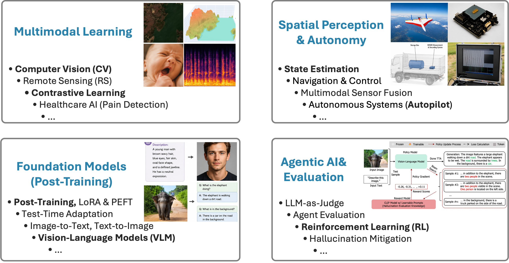

# Hi, I'm Fei Zhao

Ph.D. in Computer Science, Machine Learning Research Scientist @ The University of Alabama at Birmingham (UAB)

#### [About Me](https://feizhao19.github.io/#bio) 
I received my Ph.D. in Computer Science at the University of Alabama at Birmingham (UAB) in December 2025, specializing in **Multimodal AI**, **Computer Vision**, **Vision–Language Models**, **Ranking/Retrieval**, and **Agentic Decision Making**. With 15+ years of experience in both research and engineering, I have published **[17 papers](https://feizhao19.github.io/#publications)** (14 as first author) in venues such as ACM CIKM, IEEE ICME, ACM SIGSPATIAL, and ACM Computing Surveys. 

#### [Research Vision](https://feizhao19.github.io/#bio)

  
   
  Click the image to see more.

